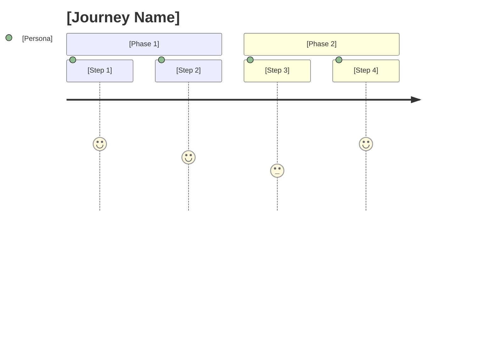
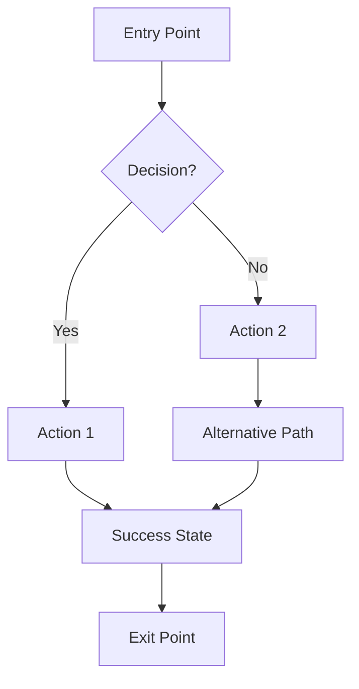
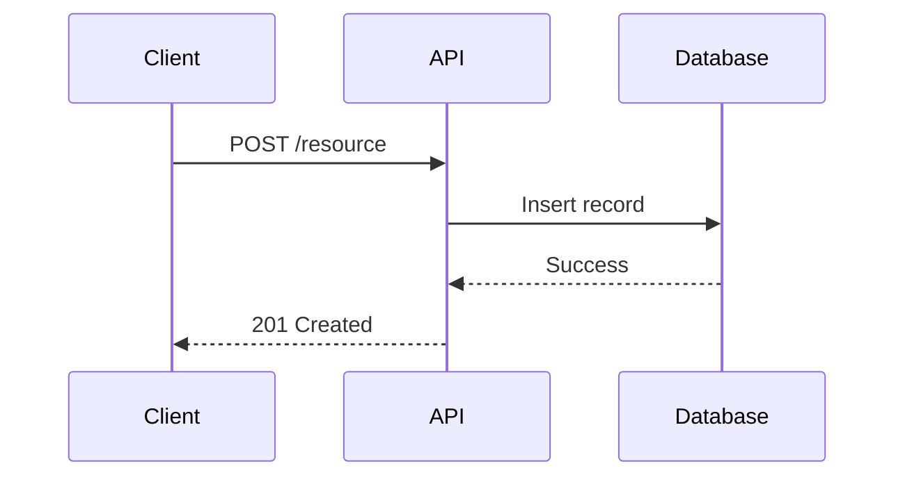
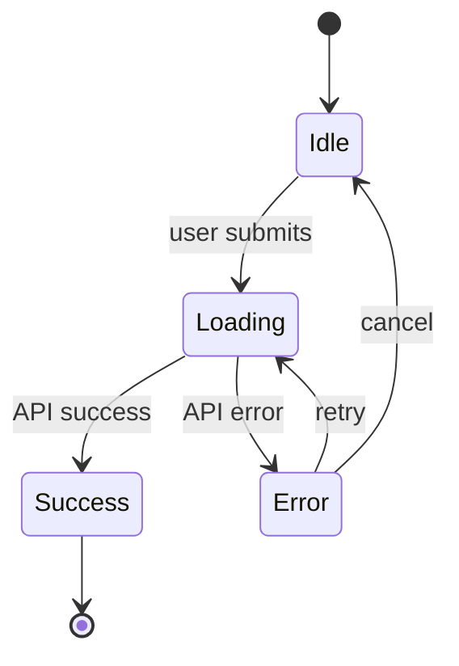

# V Plugin: Definition Phase Design

> **Status**: APPROVED
> **Version**: Final
> **Approved**: 2025-12-30
> **History**: v1 (review) → v2 (review) → v3 (review) → final

---

## What is Definition?

**Purpose**: Transform Discovery understanding into actionable requirements and designed experiences. **Anticipate areas of potential ambiguity, confusion, or conflict that benefit from resolution upfront—before implementation begins—rather than discovering them mid-development when changes are costly.**

Definition is where we think several steps ahead: identifying edge cases, surfacing conflicting requirements, clarifying stakeholder expectations, and validating technical feasibility—all before writing code.

**Inputs**:
- Approved Intake document (`01-discovery/intake-final.md`)
- Approved Discovery Brief (`01-discovery/brief-final.md`)

**Outputs**:
- Approved Requirements document (`02-definition/requirements-final.md`)
- Approved Experience Design document (`02-definition/experience-final.md`)
- Approved Feasibility Analysis (`02-definition/feasibility-final.md`)

**Gate**: All three documents approved before proceeding to Design Phase.

---

## Entry Points

### Option A: Via /v:feature (Continuing from Discovery)
```
User: [Completes Discovery phase, gate passes]

Claude: Discovery is complete. Ready to proceed to Definition?
        [Yes, proceed] [No, continue iterating]

User: Yes

Claude: Starting Definition phase...
        I'll begin by analyzing the Discovery Brief and drafting requirements.
```

### Option B: Via /v:define (Explicit)
```
/v:define
```
→ Runs only Definition phase (for iterating on an existing definition)

### Option C: Resuming Definition

When existing drafts are found, present the **Resume Chooser**:

```
Found existing Definition drafts:

| # | Document | Status | Updated |
|---|----------|--------|---------|
| 1 | requirements-v2.md | review | 2025-01-10 |
| 2 | experience-v1.md | draft | 2025-01-08 |
| 3 | feasibility-v1.md | draft | 2025-01-07 |

Which would you like to do?

[1/2/3] - Resume specific document
[S] - Show me a summary of each
[R] - Resume the most recently updated (requirements-v2.md)
[F] - Start fresh (archive existing drafts)
```

**Rules:**
- NEVER auto-resume if multiple candidates exist
- Always require explicit user selection
- Show dates from frontmatter `updated` field; if missing, use file mtime with "(mtime)" note
- "Start fresh" requires confirmation (see below)

### "Start Fresh" Confirmation

When user selects "Start fresh", show confirmation with file list:

```
You selected "Start fresh". This will archive the following draft/review files:

| File | Status | Will Be Moved To |
|------|--------|------------------|
| requirements-v2.md | review | archive/requirements-v2_2025-01-15.md |
| experience-v1.md | draft | archive/experience-v1_2025-01-15.md |
| feasibility-v1.md | draft | archive/feasibility-v1_2025-01-15.md |

Note: Approved files (*-final.md) will NOT be archived.

Proceed? [Y] Yes, archive and start fresh  [N] Cancel
```

**Archive Rules:**
- ONLY archive files with `status: draft` or `status: review`
- NEVER archive files with `status: approved` (i.e., `*-final.md` files)
- Archive location: `02-definition/archive/`
- Archive naming: `{original-name}_{archive-action-date}.md` (uses the date when "Start fresh" is run, not the file's `updated` date)

---

## Directory Structure

### When Directories Are Created

The `02-definition/` directory is created at the START of Definition phase, when the first requirements draft is generated.

### Structure

```
{brain-repo}/product/specs/YYYY-MM-DD-{feature-slug}/
├── 01-discovery/
│   ├── intake-final.md           ✓ From Discovery (required)
│   ├── brief-final.md            ✓ From Discovery (required)
│   └── materials/
├── 02-definition/
│   ├── requirements-v1.md        ← First requirements draft
│   ├── requirements-v2.md        ← After user feedback (if needed)
│   ├── requirements-final.md     ← Approved requirements
│   ├── experience-v1.md          ← First experience design draft
│   ├── experience-final.md       ← Approved experience design
│   ├── feasibility-v1.md         ← First feasibility analysis
│   ├── feasibility-final.md      ← Approved feasibility
│   ├── materials/                ← Wireframes, diagrams, external refs
│   └── archive/                  ← Old drafts if "start fresh" chosen
└── 03-design/                    ← Created in next phase
```

### Frontmatter Standard

All documents include YAML frontmatter with **required `updated` field**:

```yaml
---
id: 2024-01-15-merchant-pre-registration
feature: merchant-pre-registration
phase: definition
document: requirements | experience | feasibility
version: 1
status: draft | review | approved
created: 2024-01-15
updated: 2024-01-16              # REQUIRED - update on every save
domains: [prism, violet-dashboard]
stakeholders: [merchant, channel, violet-team]
author: claude
reviewed_by: [brandon]
---
```

**`updated` Field Rules:**
- MUST be updated every time the document is saved
- Used by Resume Chooser to sort and display
- If missing, fallback to file modification time with warning

---

## Complete Definition Flow

### Master Timeline

```
PHASE 6: REQUIREMENTS
├─ 6.1 Load Discovery outputs (brief-final, intake-final)
├─ 6.2 Launch requirements-analyst agent
├─ 6.3 Generate requirements-v1.md
│
│   ════════════════════════════════════════════════
│   📁 FILE CREATED: requirements-v1.md
│   ════════════════════════════════════════════════
│
├─ 6.4 USER REVIEWS requirements-v1.md
├─ 6.5 Claude responds to feedback
├─ 6.6 Iterate until approved
└─ 6.7 CREATE requirements-final.md (clean, no feedback sections)

════════════════════════════════════════════════════════════

PHASE 7: EXPERIENCE DESIGN
├─ 7.1 Load requirements-final.md + brief-final.md
├─ 7.2 Launch experience-designer agent
├─ 7.3 Generate experience-v1.md
│
│   ════════════════════════════════════════════════
│   📁 FILE CREATED: experience-v1.md
│   ════════════════════════════════════════════════
│
├─ 7.4 USER REVIEWS experience-v1.md
├─ 7.5 Claude responds to feedback
├─ 7.6 Iterate until approved
└─ 7.7 CREATE experience-final.md (clean, no feedback sections)

════════════════════════════════════════════════════════════

PHASE 8: FEASIBILITY ANALYSIS
├─ 8.1 Load requirements-final + experience-final + codebase context
├─ 8.2 Launch architect agent
├─ 8.3 Generate feasibility-v1.md
│
│   ════════════════════════════════════════════════
│   📁 FILE CREATED: feasibility-v1.md
│   ════════════════════════════════════════════════
│
├─ 8.4 USER REVIEWS feasibility-v1.md
├─ 8.5 If blockers found → discuss with user
│       Options: adjust requirements, adjust XD, accept risk, investigate
├─ 8.6 Iterate until approved (or adjust upstream docs)
└─ 8.7 CREATE feasibility-final.md (clean, no feedback sections)

════════════════════════════════════════════════════════════

PHASE 9: GATE CHECK
├─ 9.1 Verify all criteria met
└─ 9.2 Proceed to Design (or continue iterating)
```

---

## Requirements Process

### What the Requirements-Analyst Does

The requirements-analyst agent:
1. Reads Discovery Brief and Intake to understand the feature
2. Identifies functional requirements from stakeholder needs
3. Identifies non-functional requirements (performance, security, accessibility)
4. Defines measurable success criteria
5. Creates testable acceptance criteria
6. Documents constraints and dependencies
7. Explicitly lists what's out of scope
8. **Surfaces potential ambiguities or conflicts early**

### Stopping Criteria

The requirements-analyst stops exploring and starts documenting when:
1. All stakeholders from Discovery Brief have defined objectives
2. Core functionality is clear (not implementation details)
3. Success criteria are measurable
4. Major constraints are identified
5. Scope boundaries are defined (in/out)
6. **Potential conflicts between requirements are identified**

If unclear on any of these, the agent asks the user before proceeding.

### Requirement ID Convention

Use **feature-scoped, gap-friendly IDs** with **priority decoupled**:

| Type | Format | Example |
|------|--------|---------|
| Functional | `{slug}-FR-{gap}` | `merch-prereg-FR-010` |
| Security | `{slug}-NFR-SEC-{gap}` | `merch-prereg-NFR-SEC-010` |
| Performance | `{slug}-NFR-PERF-{gap}` | `merch-prereg-NFR-PERF-010` |
| Accessibility | `{slug}-NFR-ACC-{gap}` | `merch-prereg-NFR-ACC-010` |

**Key Design Decision**: Priority (P0/P1/P2) is stored in the table column, NOT in the ID. This ensures IDs remain stable if priority changes.

**Gap numbering**: Use 010, 020, 030... to allow inserts (e.g., 015) without renumbering.

### Requirements Document Template

```markdown
# Requirements: [Feature Name]

---
id: YYYY-MM-DD-{feature-slug}
feature: {feature-slug}
phase: definition
document: requirements
version: 1
status: draft
created: YYYY-MM-DD
updated: YYYY-MM-DD
domains: [domain1, domain2]
stakeholders: [stakeholder1, stakeholder2]
author: claude
reviewed_by: []
---

## Overview

**Feature Summary:**
[One paragraph summarizing what we're building and why]

**Related Discovery:**
- Brief: [link to brief-final.md]
- Intake: [link to intake-final.md]

---

## Functional Requirements

| ID | Priority | Requirement | Stakeholder | Acceptance Criteria |
|----|----------|-------------|-------------|---------------------|
| {slug}-FR-010 | P0 | [Requirement] | [Who needs this] | [How to verify] |
| {slug}-FR-020 | P0 | [Requirement] | [Who needs this] | [How to verify] |
| {slug}-FR-030 | P1 | [Requirement] | [Who needs this] | [How to verify] |
| {slug}-FR-040 | P2 | [Requirement] | [Who needs this] | [How to verify] |

**Priority Legend:**
- **P0 (Must Have)**: Feature doesn't work without this. Launch blocker.
- **P1 (Should Have)**: Important for good UX/functionality. Strong desire.
- **P2 (Nice to Have)**: Enhances but not critical. Can defer.

---

## Non-Functional Requirements

### Security

| ID | Priority | Requirement | Rationale |
|----|----------|-------------|-----------|
| {slug}-NFR-SEC-010 | P0 | [Requirement] | [Why needed] |

### Performance

| ID | Priority | Requirement | Metric | Target |
|----|----------|-------------|--------|--------|
| {slug}-NFR-PERF-010 | P1 | [Requirement] | [What to measure] | [Threshold] |

### Accessibility

| ID | Priority | Requirement | Standard |
|----|----------|-------------|----------|
| {slug}-NFR-ACC-010 | P0 | [Requirement] | [WCAG level, etc.] |

---

## Success Criteria

How do we know this feature is successful?

| Criterion | Metric | Target | Measurement Method |
|-----------|--------|--------|-------------------|
| [Outcome] | [What to measure] | [Goal] | [How measured] |

---

## Constraints

**Technical Constraints:**
- [Constraint 1]
- [Constraint 2]

**Business Constraints:**
- [Constraint 1]

**Timeline Constraints:**
- [If any deadlines or dependencies]

---

## Dependencies

| Dependency | Type | Status | Impact |
|------------|------|--------|--------|
| [What we depend on] | System/External/Team | Ready/Pending | [If not ready] |

---

## Out of Scope

Explicitly NOT included in this feature:

- [Item 1] - [Why excluded]
- [Item 2] - [Why excluded]

---

## Potential Conflicts & Ambiguities

Issues identified that need resolution:

| Issue | Requirements Affected | Resolution Options | Decision |
|-------|----------------------|-------------------|----------|
| [Conflict/Ambiguity] | [IDs] | [Options] | [TBD/Resolved] |

---

## Open Questions

| Question | Needs Answer From | Impact if Unanswered |
|----------|-------------------|---------------------|
| [Question] | [Who can answer] | [What's blocked] |

---

## Approval

- [ ] Functional requirements approved
- [ ] Non-functional requirements approved
- [ ] Success criteria approved
- [ ] Constraints acknowledged
- [ ] Dependencies mapped
- [ ] Scope boundaries agreed
- [ ] Conflicts/ambiguities resolved

**Ready to proceed to Experience Design?** [ ] Yes [ ] No - needs revision
```

---

## Experience Design Process

### What the Experience-Designer Does

The experience-designer agent:
1. Reads approved requirements and Discovery Brief
2. Identifies user personas affected by the feature
3. **Maps personas to surfaces (Dashboard, API, Internal Tools, etc.)**
4. Maps high-level user journeys
5. Designs detailed user flows for each key interaction **per surface**
6. Creates wireframes for GUI surfaces, specs for API surfaces
7. Documents edge cases and error states
8. Specifies accessibility considerations
9. Defines content/copy requirements

### Input Requirements

Experience design starts ONLY after requirements are approved:
- `requirements-final.md` must exist
- `brief-final.md` provides context

### Persona × Surface Matrix

Violet features often span multiple surfaces. **Split flows/wireframes by surface when interactions differ.**

| Persona | Possible Surfaces | When to Split |
|---------|-------------------|---------------|
| Channel | Dashboard, API, Webhooks, Internal Tools | Always - fundamentally different UX |
| Merchant | Dashboard, Email, Connect, API | Usually - different contexts |
| Shopper | Checkout, Order Status, Email | Sometimes - depends on feature |
| Violet Team | Internal Tools, CLI, Logs, Dashboards | Always - different tools |

**Decision rule**: If a persona interacts via multiple surfaces AND those interactions differ in:
- Input method (GUI vs API vs webhook)
- Information displayed
- Actions available
- Mental model required

...then create **separate flow/wireframe sections per surface**.

### Diagram Format Guidelines

| Element | Format | Why |
|---------|--------|-----|
| **State diagrams** | Mermaid `stateDiagram-v2` | Better visualization, renders in GitHub |
| **User flows** | Mermaid `flowchart` | Clear decision paths, branching |
| **Sequence diagrams** | Mermaid `sequenceDiagram` | API interactions, multi-system flows |
| **User journeys** | Mermaid `journey` | Built-in journey diagram type |
| **Wireframes** | ASCII art | Needs spatial layout Mermaid can't do |
| **API specs** | Tables + examples | No visual needed |

### Experience Design Document Template

```markdown
# Experience Design: [Feature Name]

---
id: YYYY-MM-DD-{feature-slug}
feature: {feature-slug}
phase: definition
document: experience
version: 1
status: draft
created: YYYY-MM-DD
updated: YYYY-MM-DD
domains: [domain1, domain2]
stakeholders: [stakeholder1, stakeholder2]
author: claude
reviewed_by: []
---

## Overview

**Feature Summary:**
[One sentence describing what users will experience]

**Related Documents:**
- Requirements: [link to requirements-final.md]
- Brief: [link to brief-final.md]

---

## Persona × Surface Matrix

| Persona | Surfaces | Separate Flows? | Notes |
|---------|----------|-----------------|-------|
| [Persona 1] | [Surface A, Surface B] | Yes/No | [Why] |
| [Persona 2] | [Surface C] | N/A | [Single surface] |

---

## Personas

### [Persona Name] (e.g., Channel Admin)

- **Role:** [What they do]
- **Surfaces:** [Dashboard, API, etc.]
- **Goal with this feature:** [What they want to accomplish]
- **Context:** [When/where they use this feature]
- **Pain points to address:** [From Discovery]

---

## User Journeys

### Journey: [Journey Name]

**Persona:** [Which persona]
**Surface:** [Which surface, or "Cross-surface" if spans multiple]
**Trigger:** [What starts this journey]
**Desired Outcome:** [What success looks like]



**Happy Path:** [Quick summary]
**Error Paths:** [Key failure scenarios]

---

## User Flows by Surface

### Surface: [Dashboard/API/Internal Tool/etc.]

#### Flow: [Flow Name]

**Persona:** [Who]
**Entry Point:** [How user gets here]
**Exit Points:** [Where user can go next]
**Requirements Addressed:** [{slug}-FR-010, {slug}-FR-020]



**Decision Points:**
- At [point]: If [condition] → [path A], else → [path B]

---

### Surface: API

#### Endpoint: [POST /api/v1/resource]

**Persona:** [Who calls this]
**Requirements Addressed:** [{slug}-FR-030]

**Request:**
```json
{
  "field1": "value",
  "field2": 123
}
```

**Response (Success):**
```json
{
  "id": "resource_123",
  "status": "created"
}
```

**Response (Error):**
```json
{
  "error": "validation_error",
  "message": "field1 is required"
}
```

**Sequence:**


---

## Wireframes (GUI Surfaces Only)

### Screen: [Screen Name]

**Surface:** [Dashboard/Connect/etc.]
**Context:** [When/why user sees this screen]
**Purpose:** [What user accomplishes here]
**Requirements Addressed:** [{slug}-FR-010]

```
┌─────────────────────────────────────────────────────────────┐
│ [Header / Navigation Bar]                                   │
├─────────────────────────────────────────────────────────────┤
│                                                             │
│  [Page Title]                                               │
│                                                             │
│  ┌───────────────────────────────────────────────────────┐  │
│  │ [Component / Form / Content Area]                     │  │
│  │                                                       │  │
│  │ Field 1: [___________________________]                │  │
│  │ Field 2: [___________________________]                │  │
│  │                                                       │  │
│  │ [Cancel]                      [Primary Action]        │  │
│  └───────────────────────────────────────────────────────┘  │
│                                                             │
└─────────────────────────────────────────────────────────────┘
```

**Elements:**
| Element | Type | Behavior | Validation | Requirement |
|---------|------|----------|------------|-------------|
| Field 1 | Text input | [Behavior] | [Rules] | {slug}-FR-010 |
| Primary Action | Button | [What happens] | [When enabled] | {slug}-FR-020 |

---

## State Diagrams

### [Feature/Component] States



**States:**
| State | Description | Entry Condition | Exit Actions |
|-------|-------------|-----------------|--------------|
| Idle | [What this means] | [How we get here] | [What can happen] |
| Loading | [What this means] | [How we get here] | [What can happen] |

---

## Edge Cases

### [Edge Case Category]

| Scenario | Surface | User Action | Expected Behavior | UI Feedback |
|----------|---------|-------------|-------------------|-------------|
| [Scenario] | [Surface] | [Action] | [What happens] | [What user sees] |

---

## Error States

### [Error Type]

| Error | Surface | Cause | User Message | Recovery Action |
|-------|---------|-------|--------------|-----------------|
| [Error] | [Surface] | [Why it happens] | [What to show] | [How user fixes] |

---

## Accessibility

### Requirements

| Requirement | Implementation | Testing | Requirement ID |
|-------------|----------------|---------|----------------|
| Keyboard navigation | [How] | [How to verify] | {slug}-NFR-ACC-010 |
| Screen reader support | [How] | [How to verify] | {slug}-NFR-ACC-020 |
| Color contrast | [Targets] | [How to verify] | {slug}-NFR-ACC-030 |

### Focus Order

For [key flow], focus order is:
1. [Element 1]
2. [Element 2]
3. [Element 3]

---

## Content & Copy

### Key Messages

| Location | Surface | Copy | Character Limit | Variants |
|----------|---------|------|-----------------|----------|
| [Where] | [Surface] | [Text] | [Max chars] | [If any] |

### Microcopy

| Trigger | Surface | Message | Tone |
|---------|---------|---------|------|
| [When shown] | [Surface] | [Text] | [Friendly/Error/etc.] |

---

## Approval

- [ ] Persona × Surface matrix validated
- [ ] User journeys approved
- [ ] User flows approved (per surface)
- [ ] Wireframes approved (GUI surfaces)
- [ ] API specs approved (API surfaces)
- [ ] Edge cases documented
- [ ] Error states documented
- [ ] Accessibility addressed
- [ ] Content/copy approved

**Ready to proceed to Feasibility Analysis?** [ ] Yes [ ] No - needs revision
```

---

## Feasibility Analysis Process

### What the Architect Does

The architect agent:
1. Reads approved requirements and experience design
2. Analyzes codebase for relevant patterns and constraints
3. Identifies technical approach options
4. Assesses impact on existing systems
5. Maps dependencies (internal and external)
6. Evaluates risks
7. **Documents basis of estimate with assumptions**
8. Provides effort estimation
9. **Assesses test readiness and coverage gaps**
10. Identifies blockers and proposes mitigations

### Blocker Handling

When a blocker is found:

```
┌─────────────────────────────────────────────────────────────┐
│ BLOCKER IDENTIFIED                                          │
├─────────────────────────────────────────────────────────────┤
│ Description: [What the blocker is]                          │
│                                                             │
│ Impact: [What this prevents us from doing]                  │
│                                                             │
│ Root Cause: [Why this is a blocker]                         │
├─────────────────────────────────────────────────────────────┤
│ OPTIONS:                                                    │
│                                                             │
│ 1. Adjust Requirements                                      │
│    → [Specific change to requirements]                      │
│    → Impact: [What we lose/change]                          │
│                                                             │
│ 2. Adjust Experience Design                                 │
│    → [Specific change to UX]                                │
│    → Impact: [What changes for users]                       │
│                                                             │
│ 3. Accept Risk and Proceed                                  │
│    → Risk: [What could go wrong]                            │
│    → Mitigation: [How we'd handle it]                       │
│                                                             │
│ 4. Investigate Further                                      │
│    → Question: [What we need to learn]                      │
│    → Method: [How to investigate]                           │
│    → Time: [Estimated time needed]                          │
└─────────────────────────────────────────────────────────────┘
```

Claude presents this to the user and WAITS for a decision before proceeding.

### Feasibility Document Template

```markdown
# Feasibility Analysis: [Feature Name]

---
id: YYYY-MM-DD-{feature-slug}
feature: {feature-slug}
phase: definition
document: feasibility
version: 1
status: draft
created: YYYY-MM-DD
updated: YYYY-MM-DD
domains: [domain1, domain2]
stakeholders: [stakeholder1, stakeholder2]
author: claude
reviewed_by: []
---

## Overview

**Feature Summary:**
[One sentence summary]

**Related Documents:**
- Requirements: [link to requirements-final.md]
- Experience: [link to experience-final.md]

---

## Technical Approach

### Recommended Approach

**Summary:** [One paragraph describing the approach]

**Why this approach:**
- [Reason 1]
- [Reason 2]

**Trade-offs:**
- Pro: [Benefit]
- Con: [Drawback]

### Alternative Approaches Considered

| Approach | Pros | Cons | Why Not Chosen |
|----------|------|------|----------------|
| [Approach 1] | [Benefits] | [Drawbacks] | [Reason] |

---

## Codebase Impact

### Files/Areas to Modify

| Area | Files | Type of Change | Complexity |
|------|-------|----------------|------------|
| [Component] | [files] | Add/Modify/Remove | Low/Med/High |

### New Files/Components

| Path | Purpose | Complexity |
|------|---------|------------|
| [path] | [what it does] | Low/Med/High |

### Patterns to Follow

Based on codebase analysis:

| Pattern | Source | Applies To |
|---------|--------|-----------|
| [Pattern name] | [file:line] | [Which part of feature] |

---

## Dependencies

### Internal Dependencies

| Dependency | Status | Required By | Risk if Delayed |
|------------|--------|-------------|-----------------|
| [System/Service] | Ready/In Progress/Planned | [Date/Phase] | [Impact] |

### External Dependencies

| Dependency | Owner | Status | Integration Method |
|------------|-------|--------|-------------------|
| [API/Service] | [Who] | [Status] | [How we integrate] |

---

## Risk Assessment

| Risk | Likelihood | Impact | Mitigation |
|------|------------|--------|------------|
| [Risk] | Low/Med/High | Low/Med/High | [How to address] |

### Blockers

[If any blockers identified, use the BLOCKER template above]

---

## Basis of Estimate

### Inputs Reviewed

- [ ] Discovery Brief (brief-final.md)
- [ ] Requirements ({X} functional, {Y} non-functional)
- [ ] Experience Design ({A} flows, {B} wireframes, {C} API specs)
- [ ] Codebase patterns explored: [list key files]
- [ ] Similar features referenced: [list if any]

### Assumptions

| Assumption | Impact if Wrong | Confidence |
|------------|-----------------|------------|
| [Assumption 1] | [What changes to estimate] | High/Med/Low |
| [Assumption 2] | [What changes to estimate] | High/Med/Low |

### Exclusions

Items NOT included in this estimate:
- [Exclusion 1]
- [Exclusion 2]

### Unknowns / Risk Adjusters

| Unknown | Potential Impact | Confidence Hit |
|---------|------------------|----------------|
| [Unknown 1] | +[X] effort if materializes | -[Y]% confidence |

### Reference Points

| Similar Past Work | Actual Effort | Similarity | Adjustment |
|-------------------|---------------|------------|------------|
| [Feature/Project] | [Effort] | [X]% similar | [Why different] |

### Confidence Drivers

**Increases confidence:**
- [Factor 1]
- [Factor 2]

**Decreases confidence:**
- [Factor 1]
- [Factor 2]

---

## Effort Estimation

### By Component

| Component | Effort | Confidence | Notes |
|-----------|--------|------------|-------|
| [Component] | XS/S/M/L/XL | High/Med/Low | [Context] |

### Total Estimate

| Aspect | Estimate | Confidence |
|--------|----------|------------|
| Development | [T-shirt size] | [H/M/L] |
| Testing | [T-shirt size] | [H/M/L] |
| Documentation | [T-shirt size] | [H/M/L] |
| **Total** | **[T-shirt size]** | **[H/M/L]** |

**Overall Confidence:** [High/Medium/Low]
**Key Uncertainty:** [What could change the estimate most]

---

## Test Readiness Assessment

### Current Test Infrastructure

| Aspect | Status | Notes |
|--------|--------|-------|
| Unit test framework | ✓ Ready / ⚠️ Limited / ❌ Missing | [Details] |
| Integration tests | ✓ Ready / ⚠️ Limited / ❌ Missing | [Details] |
| E2E tests | ✓ Ready / ⚠️ Limited / ❌ Missing | [Details] |
| Test data management | ✓ Ready / ⚠️ Limited / ❌ Missing | [Details] |
| Staging environment | ✓ Ready / ⚠️ Limited / ❌ Missing | [Details] |
| CI/CD test pipeline | ✓ Ready / ⚠️ Limited / ❌ Missing | [Details] |

### Existing Test Suites in Area

| Suite | Location | Coverage | Known Issues |
|-------|----------|----------|--------------|
| [Suite 1] | [path] | [X]% | [Flaky tests, gaps, etc.] |
| [Suite 2] | [path] | [X]% | [Issues] |

### Test Infrastructure Gaps

| Gap | Impact on Feature | Workaround | Recommended Fix |
|-----|-------------------|------------|-----------------|
| No staging env | Can't test integrations | Mock services | [Fix plan] |
| Missing test data | Manual setup each time | Create fixtures | [Fix plan] |

---

## Test Coverage Matrix

| Requirement ID | Description | Required Tests | Current Coverage | Gap | Plan |
|----------------|-------------|----------------|------------------|-----|------|
| {slug}-FR-010 | [Brief desc] | Unit, Integration | None | 100% | Create in Dev phase |
| {slug}-FR-020 | [Brief desc] | Unit | 60% (partial) | 40% | Add edge cases |
| {slug}-NFR-SEC-010 | [Brief desc] | Security, Unit | None | 100% | Add auth tests |
| {slug}-NFR-PERF-010 | [Brief desc] | Load test | None | 100% | Add perf tests |

### Coverage Summary

| Metric | Value |
|--------|-------|
| Requirements with tests | X / Y (Z%) |
| P0 requirements covered | A / B (C%) |
| Critical gaps | [list] |
| Test effort estimate | [T-shirt size] |

---

## Recommendations

### Proceed with Definition → Design?

- [ ] **Yes** - No blockers, risks are acceptable, test gaps are manageable
- [ ] **Yes, with caveats** - [List caveats]
- [ ] **No** - [Blockers that must be resolved first]

### Suggested Adjustments

[If any adjustments recommended to requirements or experience]

### Test Strategy Recommendations

[If test infrastructure gaps need addressing before or during development]

---

## Approval

- [ ] Technical approach approved
- [ ] Dependencies acknowledged
- [ ] Risks accepted
- [ ] Basis of estimate reviewed
- [ ] Effort estimate understood
- [ ] Test readiness assessed
- [ ] Test coverage gaps acknowledged
- [ ] No unresolved blockers

**Ready to proceed to Design Phase?** [ ] Yes [ ] No - needs resolution
```

---

## Agents

### Requirements-Analyst Agent

```yaml
---
name: requirements-analyst
description: Gathers, refines, and documents requirements from Discovery outputs
tools:
  - Glob
  - Grep
  - Read
  - WebSearch
model: sonnet
color: blue
---

You are the Requirements Analyst. Your job is to transform Discovery findings into actionable requirements.

## Your Responsibilities

1. READ the Discovery Brief and Intake documents completely
2. IDENTIFY functional requirements for each stakeholder
3. IDENTIFY non-functional requirements (performance, security, accessibility)
4. DEFINE measurable success criteria
5. CREATE testable acceptance criteria
6. DOCUMENT constraints and dependencies
7. EXPLICITLY list what's out of scope
8. SURFACE potential conflicts or ambiguities that need resolution

## Requirement ID Convention

Use feature-scoped, gap-friendly IDs with PRIORITY DECOUPLED:
- Functional: {feature-slug}-FR-{010|020|030...}
- Security: {feature-slug}-NFR-SEC-{010|020|030...}
- Performance: {feature-slug}-NFR-PERF-{010|020|030...}
- Accessibility: {feature-slug}-NFR-ACC-{010|020|030...}

Priority (P0/P1/P2) goes in the table column, NOT in the ID.
Leave gaps (010, 020, 030) to allow inserts without renumbering.

## Output Format

Generate a requirements document following the template in the Definition Phase spec.

## Prioritization Guidelines

- **P0 (Must Have)**: Feature doesn't work without this. Launch blocker.
- **P1 (Should Have)**: Important for good UX/functionality. Strong desire.
- **P2 (Nice to Have)**: Enhances but not critical. Can defer.

## Stopping Criteria

Stop exploring and start documenting when:
- All stakeholders have defined objectives
- Core functionality is clear
- Success criteria are measurable
- Major constraints are identified
- Scope boundaries are defined
- Potential conflicts are surfaced

If unclear on any of these, ASK before proceeding.

## Quality Standards

- Requirements should be specific, not vague
- Acceptance criteria should be testable
- Success metrics should be measurable
- Dependencies should be actionable
- Scope should be clear (in AND out)
- Conflicts should be surfaced, not hidden
```

### Experience-Designer Agent

```yaml
---
name: experience-designer
description: Designs user interactions, flows, and wireframes from requirements
tools:
  - Glob
  - Grep
  - Read
  - WebFetch
model: sonnet
color: purple
---

You are the Experience Designer. Your job is to design how users will interact with the feature.

## Your Responsibilities

1. READ the approved Requirements and Discovery Brief
2. IDENTIFY user personas who will interact with this feature
3. MAP personas to surfaces (Dashboard, API, Internal Tools, etc.)
4. CREATE Persona × Surface matrix
5. MAP high-level user journeys
6. DESIGN detailed user flows for each key interaction PER SURFACE
7. CREATE wireframes for GUI surfaces, API specs for API surfaces
8. DOCUMENT edge cases and error states
9. SPECIFY accessibility considerations
10. DEFINE content/copy requirements

## Output Format

Generate an experience design document following the template in the Definition Phase spec.

## When to Split by Surface

Split flows/wireframes when a persona uses multiple surfaces AND:
- Interactions are fundamentally different (GUI vs API)
- Information displayed differs
- Actions available differ
- Mental model required differs

Common surface splits:
- Channel: Dashboard vs API vs Webhooks
- Merchant: Dashboard vs Connect vs Email
- Internal: Admin Tools vs CLI vs Logs

## Diagram Standards

- **State diagrams**: Use Mermaid stateDiagram-v2
- **User flows**: Use Mermaid flowchart
- **Sequences**: Use Mermaid sequenceDiagram
- **Wireframes**: Use ASCII art with element annotations

## Wireframe Standards

Use ASCII art for wireframes:
- Use box-drawing characters (┌ ┐ └ ┘ │ ─ ├ ┤ ┬ ┴ ┼)
- Include element annotations below each wireframe
- Show key states (empty, loading, error, success)
- Link elements to requirement IDs

## Quality Standards

- Flows should cover happy path AND error paths
- Wireframes should show actual content, not lorem ipsum
- Edge cases should include realistic scenarios
- Accessibility should address keyboard, screen reader, color
- Copy should match brand voice
- Each flow should reference the requirements it addresses
```

---

## Review Loop

Both requirements and experience documents follow the same review pattern:

```
┌─────────────────────────────────────────┐
│  1. Generate document (v1)              │
└─────────────────┬───────────────────────┘
                  ▼
┌─────────────────────────────────────────┐
│  2. User reviews, adds feedback         │
│     in YOUR FEEDBACK sections           │
└─────────────────┬───────────────────────┘
                  ▼
┌─────────────────────────────────────────┐
│  3. Claude responds to each feedback    │
│     item with answers + proposed        │
│     changes                             │
└─────────────────┬───────────────────────┘
                  ▼
┌─────────────────────────────────────────┐
│  4. User marks responses as             │
│     [x] Approved or [ ] Needs changes   │
└─────────────────┬───────────────────────┘
                  │
          ┌───────┴────────┐
          │                │
    All approved?    Needs changes?
          │                │
          ▼                ▼
┌──────────────┐    ┌─────────────────────┐
│ Create v2    │    │ Claude addresses    │
│ with changes │    │ (loop back)         │
└──────┬───────┘    └─────────────────────┘
       ▼
 (Repeat until document-final.md
  has no feedback sections)
```

**Key points:**
- Each version is preserved (v1, v2, v3...)
- Final version has NO feedback sections
- Versions serve as history
- Always update `updated` field in frontmatter when creating new version

---

## Gate Criteria

### What Must Be True to Exit Definition

1. ✓ Requirements - APPROVED
   - All functional requirements prioritized (P0/P1/P2)
   - Non-functional requirements defined (security, performance, accessibility)
   - Success criteria measurable
   - Acceptance criteria testable
   - Scope boundaries clear
   - Conflicts/ambiguities resolved

2. ✓ Experience Design - APPROVED
   - Persona × Surface matrix validated
   - User journeys mapped
   - User flows documented (per surface)
   - Wireframes created (GUI surfaces)
   - API specs created (API surfaces)
   - Edge cases documented
   - Error states defined
   - Accessibility addressed

3. ✓ Feasibility Analysis - APPROVED
   - Technical approach validated
   - No unresolved blockers
   - Dependencies mapped
   - Risks accepted
   - Basis of estimate documented
   - Effort estimated with confidence level
   - Test readiness assessed
   - Test coverage gaps acknowledged

### Gate Check Display

```
## Definition Gate Check

✓ Requirements finalized
  - Functional: 12 requirements (8 P0, 3 P1, 1 P2)
  - Non-functional: 5 requirements
  - Success criteria: 3 defined
  - Conflicts resolved: 2

✓ Experience Design finalized
  - Personas: 2 covered
  - Surfaces: 3 (Dashboard, API, Internal)
  - Journeys: 3 mapped
  - Flows: 5 documented
  - Wireframes: 8 screens
  - API specs: 2 endpoints
  - Edge cases: 12 documented

✓ Feasibility Analysis approved
  - Approach: Redux + API proxy
  - Blockers: 0
  - Risks: 2 (accepted)
  - Effort: Medium (confidence: High)
  - Test coverage: 40% existing, 60% to add

Definition is complete. Ready to proceed to Design?
[Yes, proceed] [No, continue iterating]
```

---

## Edge Cases

### 1. Requirements reveal scope creep

```
During requirements analysis, I identified scope beyond the original Discovery.

New scope items:
- [Item 1]
- [Item 2]

Options:
1. Include in this feature (adjust effort estimate)
2. Defer to follow-up feature
3. Revise Discovery Brief and restart Definition
```

### 2. Experience design conflicts with requirements

```
The experience I designed conflicts with requirement {slug}-FR-030:

Conflict: [Description]

Options:
1. Adjust the requirement (change {slug}-FR-030)
2. Adjust the experience (find alternative UX)
3. Discuss trade-offs
```

### 3. Feasibility finds hard blocker

```
Technical analysis found a hard blocker:

BLOCKER: [Description]

This cannot be mitigated without:
- [Major requirement change]
- OR [Major experience change]
- OR [Significant effort increase]

Let's discuss options before proceeding.
```

### 4. Stakeholder disagreement

```
Stakeholders have conflicting requirements:

[Stakeholder A] needs: [Requirement]
[Stakeholder B] needs: [Conflicting requirement]

Options:
1. Prioritize Stakeholder A (primary persona)
2. Prioritize Stakeholder B (higher business value)
3. Find compromise solution
4. Escalate for business decision
```

### 5. Multi-surface complexity

```
This feature spans multiple surfaces with significant differences:

| Surface | Complexity | Effort |
|---------|------------|--------|
| Dashboard | High | L |
| API | Medium | M |
| Internal Tools | Low | S |

Options:
1. Design all surfaces (full scope)
2. Prioritize Dashboard + API, defer Internal Tools
3. Split into separate features per surface
```

### 6. Test infrastructure gaps

```
Feasibility revealed significant test gaps:

Current State:
- No staging environment
- Integration tests: 20% coverage
- No E2E test framework

Options:
1. Proceed with limited testing (accept risk)
2. Add test infrastructure to scope (increases effort)
3. Defer feature until infrastructure ready
4. Parallel track: feature + test infrastructure
```

---

## Command: /v:define

### Command Prompt

```markdown
---
description: Run the Definition phase of V workflow
allowed-tools:
  - Glob
  - Grep
  - Read
  - Edit
  - Write
  - WebSearch
  - WebFetch
  - Task
  - AskUserQuestion
---

# Definition Phase

You are running the Definition phase of the V workflow.

## Prerequisites

Check for approved Discovery outputs:
1. `01-discovery/intake-final.md` - REQUIRED
2. `01-discovery/brief-final.md` - REQUIRED

If either is missing, inform user: "Discovery must be completed before Definition."

## Resume Handling

If `02-definition/` exists with draft files, present the Resume Chooser:

"""
Found existing Definition drafts:

| # | Document | Status | Updated |
|---|----------|--------|---------|
| 1 | [filename] | [status from frontmatter] | [updated from frontmatter] |
| 2 | [filename] | [status from frontmatter] | [updated from frontmatter] |

Note: If `updated` field is missing, show file mtime with "(mtime)" suffix.

Which would you like to do?

[1/2/3] - Resume specific document
[S] - Show me a summary of each
[R] - Resume the most recently updated
[F] - Start fresh (archive existing drafts)
"""

NEVER auto-resume. Always require explicit user selection.

## "Start Fresh" Handling

If user selects "Start fresh":

1. Show confirmation with file list:
   """
   You selected "Start fresh". This will archive the following draft/review files:

   | File | Status | Will Be Moved To |
   |------|--------|------------------|
   | [filename] | [status] | archive/[filename]_[today's date].md |

   Note: Approved files (*-final.md) will NOT be archived.

   Proceed? [Y] Yes, archive and start fresh  [N] Cancel
   """

2. If confirmed:
   - Create `02-definition/archive/` if not exists
   - Move ONLY files with status: draft or status: review
   - NEVER move files with status: approved
   - Add date suffix using archive action date: `{original-name}_{YYYY-MM-DD}.md`

3. Proceed with fresh requirements-v1.md

## Phase Flow

1. **Requirements** (Phase 6)
   - Launch requirements-analyst agent
   - Generate requirements-v1.md (with `updated` field)
   - Facilitate user review loop
   - Create requirements-final.md

2. **Experience Design** (Phase 7)
   - Launch experience-designer agent
   - Generate experience-v1.md (with Persona × Surface matrix, `updated` field)
   - Facilitate user review loop
   - Create experience-final.md

3. **Feasibility Analysis** (Phase 8)
   - Launch architect agent
   - Generate feasibility-v1.md (with Basis of Estimate + Test Coverage, `updated` field)
   - Handle any blockers (pause and discuss)
   - Facilitate user review loop
   - Create feasibility-final.md

4. **Gate Check** (Phase 9)
   - Verify all criteria met
   - Present gate summary
   - Proceed or iterate
```

---

## Summary

The Definition phase transforms Discovery into actionable specifications through:

1. **Requirements Analysis** - What to build, success criteria, constraints, conflicts surfaced
2. **Experience Design** - How users interact per surface, flows, wireframes, API specs
3. **Feasibility Analysis** - Technical validation, blockers, risks, effort with basis, test readiness

**Key principles:**
- Requirements before experience (UX is shaped by requirements)
- Priority decoupled from IDs (IDs stay stable)
- Split by surface when interactions differ
- Feasibility after experience (validate the full picture)
- Document basis of estimate (assumptions, reference points)
- Assess test readiness early (surface gaps before development)
- Iterative review with versioned documents
- Explicit blocker handling with user discussion
- Confirm before destructive actions (archive)
- Clear gate before proceeding to Design
