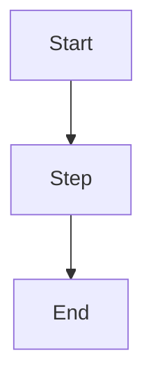

# Docs Agent Briefing: Shopify Custom App Migration Guide

## Overview
Add external-facing channel partner documentation for merchant pre-registration to the docs site.

**Target Location**: `/Users/brandonschulz/code/violetio/docs/channel-docs/prism/violet-connect/guides/shopify-custom-app-migration.md`

---

## Documentation Platform & Format

### Platform: Mintlify/GitBook-compatible Markdown
The docs site uses Mintlify markdown with special syntax for callouts, embeds, and structured content.

### File Structure

**New File Path**: `/Users/brandonschulz/code/violetio/docs/channel-docs/prism/violet-connect/guides/shopify-custom-app-migration.md`

**Frontmatter Template**:
```yaml
---
title: Shopify Custom App Migration Guide
sidebarTitle: Custom App Migration
description: Step-by-step guide for pre-registering merchants in Channel Dashboard
---
```

---

## Markdown Formatting Conventions

### Heading Hierarchy
- **H1** (`# Title`): Page title (should match frontmatter title) — Usually implicit from frontmatter
- **H2** (`## Section`): Major sections (Introduction, Pre-Registered Tab Access, Retrieve Link, Three Paths, Behind Scenes, Troubleshooting, FAQ)
- **H3** (`### Subsection`): Subsections within major sections (e.g., "Path 1: Pre-Constructed Link")
- **H4** (`#### Subsubsection`): Deep nesting only if necessary

### Lists
- **Numbered lists** (`1. Item`): For step-by-step procedures
- **Bullet points** (`- Item`): For features, tips, descriptions, and features
- **Bold** (`**text**`): For emphasis on key terms or field names
- **Inline code** (`` `code` ``): For technical values, URLs, parameter names

### Tables
Use markdown tables for comparisons and reference information:
```markdown
| Column 1 | Column 2 | Column 3 |
|----------|----------|----------|
| Value | Value | Value |
```

### Callout Boxes (Hints)

**Information Box**:
```markdown

Informational note - use for tips and recommendations

```

**Warning Box**:
```markdown

Important warning or caution

```

**Success Box**:
```markdown

Positive outcome or confirmation

```

### Collapsible Sections
Use HTML `<details>` tags for FAQ and Troubleshooting:
```markdown
<details>
  <summary>Question or Problem Title</summary>

  Answer or solution content here.
  Can include multiple paragraphs, lists, etc.
</details>
```

### Diagrams & Flow Charts
Mermaid diagrams in markdown code block:
````markdown

````

### Links
- **Internal links**: `[Link text](../path/to/file.md)` or `[Link text](./file.md)`
- **External links**: `[Link text](https://example.com)`
- **Anchor links**: `[Link text](#section-heading)` (heading must be present on page)

### Images
```markdown

```

---

## Content Structure

### Seven Sections to Include

#### Section 1: Introduction
- Explain the purpose of merchant pre-registration
- Mention streamlined onboarding and credential configuration
- Overview of different merchant paths available

#### Section 2: Pre-Registered Tab Access
- H2: "Pre-Registration in Channel Dashboard" or "Accessing Pre-Registered Tab"
- H3: "Access the Pre-Registered Tab"
  - Numbered steps to navigate to Pre-Registered tab
  - Click "Add Pre-Registration" button
- H3: "Pre-Registered Table View"
  - Description of table columns: Merchant Name, Store URL, Merchant ID, Status, Actions
  - Actions menu description (Copy Violet Connect Link, Copy Install Link, Edit, Delete)
  - Note about automatic status change to "Connected Merchants" tab
- H3: "Add Pre-Registration Form"
  - Description of form with 5 required fields
  - Table with Field | Description | Source columns
  - List of required fields:
    - Merchant Name (Display name)
    - Store URL (Shopify store URL, must be *.myshopify.com)
    - Client ID (OAuth client identifier from Shopify Partner Dashboard)
    - Client Secret (OAuth secret from Shopify Partner Dashboard)
    - Install Link (Merchant-specific URL from Shopify Partner Dashboard)
- H3: "After Submission"
  - Success modal shows Violet Connect link
  - Link format: `https://connect.violet.io/oauth?merchantId=mrc_abc123`
  - Recommendation to send this link to merchant

#### Section 3: Retrieve Installation Link
- H2: "Getting the Installation Link"
- H3: "Getting the Link from Channel Dashboard"
  - Numbered steps to retrieve link from Pre-Registered tab
  - Click actions menu → copy link
- H3: "Which Link to Send?"
  - Table comparing: Link Type | When to Use | Merchant Experience
  - Violet Connect Link (Recommended) vs Shopify Install Link
  - Recommendation callout for Violet Connect Link

#### Section 4: Three Merchant Paths
- H2: "Understanding the Three Merchant Paths"
- Intro: Explain that all paths result in connected store
- H3: "Path 1: Pre-Constructed Violet Connect Link (Recommended)"
  - Merchant Experience (numbered steps 1-8)
  - Why recommended (fewest steps, pre-filled, single click)
  - Use `` for recommendation
- H3: "Path 2: Standard Violet Connect Link (Store URL Lookup)"
  - Merchant Experience (numbered steps 1-10)
  - When to use (existing link, merchant enters store URL)
- H3: "Path 3: Direct Shopify Install Link"
  - Merchant Experience (numbered steps 1-7)
  - When to use (merchant prefers Shopify-first)
  - Note about different OAuth order

#### Section 5: Behind the Scenes
- H2: "What Happens Behind the Scenes" or "How It Works"
- Simplified explanation (4 steps):
  1. Violet receives confirmation from Shopify
  2. Violet uses pre-registered credentials
  3. Store status updates to "Active"
  4. Merchant moves to "Connected Merchants" tab
- Note that merchants don't handle technical OAuth details

#### Section 6: Troubleshooting
- H2: "Troubleshooting Common Issues"
- 4 problems using `<details>` tags:
  1. **Pre-Registration Not Found**
     - Problem description
     - Possible causes (deleted, wrong merchantId, expired link)
     - Solution
  2. **Merchant Already Connected**
     - Problem description
     - Cause
     - Solution
  3. **Wrong Store URL**
     - Problem description
     - Cause
     - Solution (numbered steps)
  4. **Permission Errors**
     - Problem description
     - Cause (missing API scopes)
     - Solution (numbered steps)

#### Section 7: FAQ
- H2: "Frequently Asked Questions"
- 4 questions using `<details>` tags:
  1. **Difference between Shopify install link and Violet Connect link**
     - Answer with bullet points for each link type
  2. **Can I edit a pre-registration after creating it?**
     - Yes answer with note about reinstallation
  3. **How do I know when merchant completed installation?**
     - Status change and tab movement
  4. **Can I pre-register same merchant multiple times?**
     - No, with explanation about deleting first

#### Section 8: Flow Diagram
- H2: "High-Level Flow" or "Installation Flow"
- Mermaid diagram showing:
  - Start: Shopify Announces Change
  - Create Custom App → Configure Settings → Generate Link
  - Pre-register Merchant
  - Choose Link Type (Violet Connect vs Shopify Link)
  - Three merchant paths with merge point
  - Merchant Authenticates → Shopify OAuth → Store Connected

---

## Navigation Integration

### Update SUMMARY.md

**Location**: `/Users/brandonschulz/code/violetio/docs/SUMMARY.md`

**Find this section**:
```
* [Guides](./channel-docs/prism/violet-connect/guides/)
  * [BigCommerce Guide](./channel-docs/prism/violet-connect/guides/violet-connect-your-bigcommerce-app.md)
  * ...other guides...
```

**Add this line** (in alphabetical or logical order):
```markdown
* [Shopify Custom App Migration](./channel-docs/prism/violet-connect/guides/shopify-custom-app-migration.md)
```

**Context**: The guides section groups platform-specific implementation guides for Violet Connect integrations.

---

## Content Requirements

### What to Include
- ✓ Clear, procedural language for channel partners
- ✓ Step-by-step numbered instructions
- ✓ Decision trees for path selection (Path 1 recommended)
- ✓ Reference tables for field descriptions and link types
- ✓ Mermaid flow diagram
- ✓ Troubleshooting with problem-solution format
- ✓ FAQ with collapsible questions
- ✓ Callout boxes for important notes and recommendations

### What to Exclude
- ✗ No ASCII box diagrams (replaced with prose descriptions)
- ✗ No internal implementation details (Redux, API routes, state management)
- ✗ No backend logic explanations
- ✗ No references to prism-brain specs or internal documentation
- ✗ No technical OAuth details (handled by Violet)

### Audience
- Channel partners implementing Shopify custom apps
- Not for Merchant end-users
- Not for internal Violet engineering

---

## Key Content Snippets

### Violet Connect Link Recommendation
Use `` callout:
```

**Recommended:** Use the Violet Connect link for the most streamlined merchant experience. This path requires the fewest steps and provides the fastest onboarding.

```

### Important Note on Automatic Status Changes
Include in Pre-Registered Tab section:
```
When a merchant completes onboarding through any path, they automatically move from "Pre-Registered" tab to "Connected Merchants" tab. Their status changes from "Pending" to "Active".
```

### Field Description Table
```markdown
| Field | Description | Source |
|-------|-------------|--------|
| **Merchant Name** | Display name for this merchant | Your choice |
| **Store URL** | The merchant's Shopify store URL | From merchant |
| **Client ID** | OAuth client identifier | Shopify Partner Dashboard (Phase 1) |
| **Client Secret** | OAuth secret key | Shopify Partner Dashboard (Phase 1) |
| **Install Link** | Merchant-specific installation URL | Shopify Partner Dashboard (Phase 1) |
```

### Link Comparison Table
```markdown
| Link Type | When to Use | Merchant Experience |
|-----------|-------------|---------------------|
| **Violet Connect Link** (Recommended) | Most cases | Fastest - merchant authenticates, then clicks one button to connect |
| **Shopify Install Link** | When merchant prefers Shopify-first flow | Merchant authorizes in Shopify first, then completes Violet authentication |
```

---

## File Operations

### Create New File
1. Create `/Users/brandonschulz/code/violetio/docs/channel-docs/prism/violet-connect/guides/shopify-custom-app-migration.md`
2. Add YAML frontmatter as specified above
3. Add all 7 content sections with proper formatting
4. Ensure Mermaid diagram is included

### Update Navigation
1. Edit `/Users/brandonschulz/code/violetio/docs/SUMMARY.md`
2. Find the guides section under `prism/violet-connect/guides/`
3. Add new line for Shopify Custom App Migration guide

### Verification Steps
- [ ] File created at correct path
- [ ] Frontmatter is valid YAML
- [ ] All 7 sections included with proper hierarchy
- [ ] Tables are properly formatted markdown
- [ ] Mermaid diagram renders without syntax errors
- [ ] All `` tags are properly closed
- [ ] All `<details>` tags are properly closed with `</details>`
- [ ] SUMMARY.md includes the new guide entry
- [ ] No ASCII art diagrams remain
- [ ] No internal implementation details included

---

## Examples of Similar Documentation

**Reference files for style/structure**:
- `/Users/brandonschulz/code/violetio/docs/channel-docs/prism/violet-connect/guides/violet-connect-your-bigcommerce-app.md` - Platform-specific guide example
- `/Users/brandonschulz/code/violetio/docs/channel-docs/prism/violet-connect/testing/connecting-a-shopify-store.md` - Shopify-specific guide example
- `/Users/brandonschulz/code/violetio/docs/channel-docs/faqs/checkout/shopify-questions.md` - Shopify FAQ example using `<details>` tags

---

## Important Notes

1. **External-Facing Content**: This is for channel partners, not merchants or Violet engineers
2. **Single Source of Truth**: Once published in docs, this is the official guide for channels
3. **No Cross-Repo References**: Keep documentation separate from prism-brain specs
4. **Mintlify Compatibility**: Use only documented Mintlify syntax
5. **Mermaid Support**: Ensure Mermaid is enabled in the docs site (it should be)
6. **Links**: Use relative paths for internal links, full URLs for external resources
