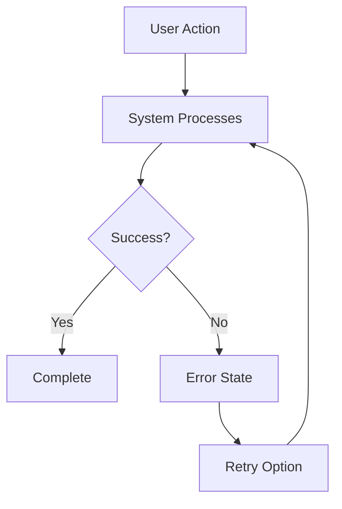
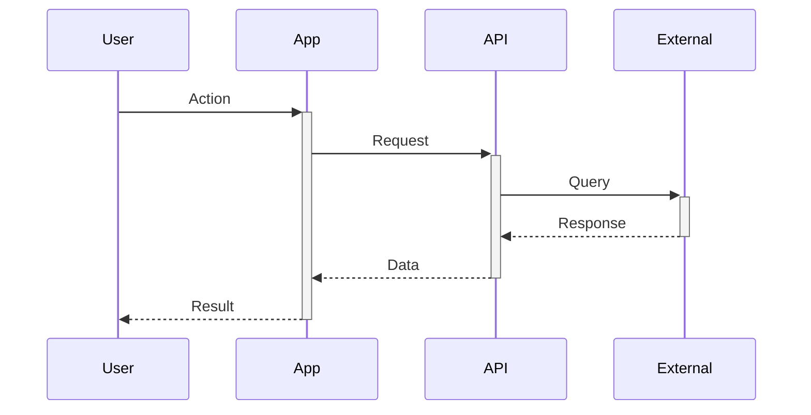
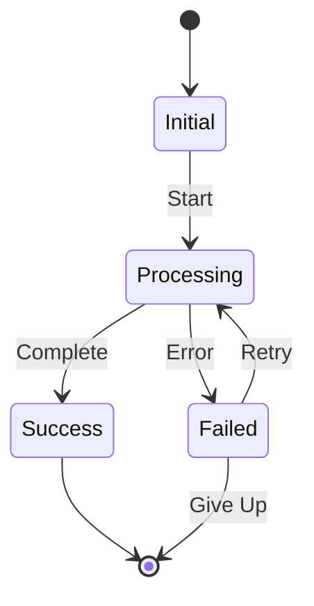
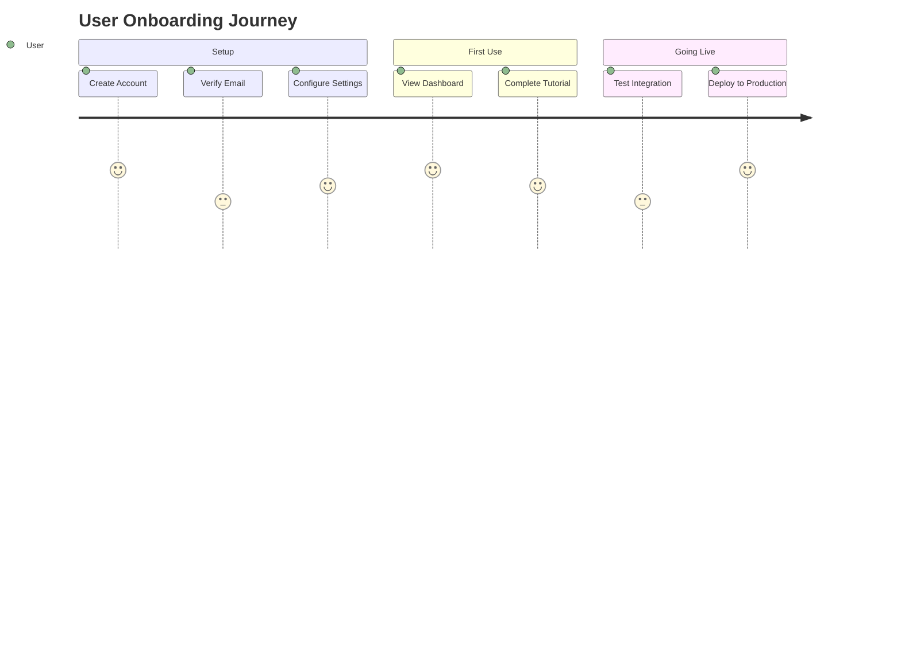

# Documentation Templates

## Overview

This file contains reusable templates and patterns for common documentation types. Use these as starting points and customize for your specific feature or platform.

---

## Migration Guide Template

### Frontmatter
```yaml
---
title: {Platform} Migration Guide
sidebarTitle: {Platform} Migration
description: Step-by-step guide for migrating to {new approach} for {platform}
---
```

### Structure

```markdown
# {Platform} Migration Guide

## Introduction
Brief overview of why this migration is needed and what will change.

## Prerequisites
- Requirement 1
- Requirement 2
- Requirement 3

## Migration Steps

### Step 1: {Action}
Detailed instructions for first step.

**Expected Outcome**: What users should see after completing this step.

### Step 2: {Action}
Detailed instructions for second step.

**Expected Outcome**: What users should see after completing this step.

### Step 3: {Action}
Continue with remaining steps...

## Verification
How to verify the migration was successful:
1. Check X
2. Verify Y
3. Test Z

## Troubleshooting

<details>
  <summary>Problem 1: {Common Issue}</summary>

  **Cause**: Why this happens

  **Solution**:
  1. Step to fix
  2. Step to fix
</details>

<details>
  <summary>Problem 2: {Another Issue}</summary>

  **Cause**: Why this happens

  **Solution**:
  1. Step to fix
  2. Step to fix
</details>

## FAQ

<details>
  <summary>Question 1</summary>

  Answer to question 1.
</details>

<details>
  <summary>Question 2</summary>

  Answer to question 2.
</details>

## Next Steps
- Link to related documentation
- Additional resources
- Support contact
```

---

## Integration Guide Template

### Frontmatter
```yaml
---
title: {Feature} Integration Guide
sidebarTitle: {Feature} Integration
description: Complete guide for integrating {feature} into your {platform/system}
---
```

### Structure

```markdown
# {Feature} Integration Guide

## Overview
What this feature does and why you'd want to integrate it.

## Prerequisites
- Technical requirement 1
- Account requirement 2
- Knowledge requirement 3

## Integration Steps

### 1. Setup
Initial setup instructions:
```language
code example
```

### 2. Configuration
Configuration instructions:
```language
code example
```

### 3. Testing
How to test the integration:
```language
code example
```

### 4. Go Live
Final steps to enable in production.

## Code Examples

### Example 1: {Common Use Case}
```language
// Code example with comments
```

### Example 2: {Another Use Case}
```language
// Code example with comments
```

## Best Practices


**Tip**: Best practice recommendation here.


- Practice 1
- Practice 2
- Practice 3

## Troubleshooting

See troubleshooting section from Migration Guide template above.

## Next Steps
- Link to API reference
- Link to advanced guides
- Link to support
```

---

## API Reference Template

### Frontmatter
```yaml
---
title: {Endpoint Name} API Reference
sidebarTitle: {Endpoint}
description: Complete API reference for {endpoint description}
---
```

### Structure

```markdown
# {Endpoint Name}

## Overview
Brief description of what this endpoint does.

## Endpoint

```http
{METHOD} /api/v1/{resource}/{id}
```

## Authentication
Authentication requirements and header format.

## Request Parameters

### Path Parameters
| Parameter | Type | Required | Description |
|-----------|------|----------|-------------|
| `id` | string | Yes | Resource identifier |

### Query Parameters
| Parameter | Type | Required | Description |
|-----------|------|----------|-------------|
| `limit` | integer | No | Number of results (default: 20) |
| `offset` | integer | No | Pagination offset (default: 0) |

### Request Body
```json
{
  "field1": "value",
  "field2": "value"
}
```

| Field | Type | Required | Description |
|-------|------|----------|-------------|
| `field1` | string | Yes | Field description |
| `field2` | string | No | Field description |

## Response

### Success Response (200 OK)
```json
{
  "id": "res_abc123",
  "field1": "value",
  "field2": "value"
}
```

| Field | Type | Description |
|-------|------|-------------|
| `id` | string | Resource identifier |
| `field1` | string | Field description |

### Error Responses

| Status Code | Description |
|-------------|-------------|
| 400 | Bad Request - Invalid parameters |
| 401 | Unauthorized - Invalid API key |
| 404 | Not Found - Resource doesn't exist |
| 500 | Internal Server Error |

## Code Examples

### cURL
```bash
curl -X {METHOD} \
  'https://api.violet.io/v1/{resource}/{id}' \
  -H 'Authorization: Bearer sk_test_...' \
  -H 'Content-Type: application/json' \
  -d '{json payload}'
```

### JavaScript/TypeScript
```typescript
const response = await violet.{resource}.{action}('{id}', {
  field1: 'value',
  field2: 'value'
});
```

### Python
```python
response = violet.{resource}.{action}(
    '{id}',
    field1='value',
    field2='value'
)
```

## Related Endpoints
- [Related Endpoint 1](#)
- [Related Endpoint 2](#)
```

---

## Troubleshooting Section Template

```markdown
## Troubleshooting

### Common Issues

<details>
  <summary>Problem: {Specific error or issue}</summary>

  **Symptoms**: What the user sees/experiences

  **Cause**: Root cause explanation

  **Solution**:
  1. Step 1 to resolve
  2. Step 2 to resolve
  3. Step 3 to resolve

  **Prevention**: How to avoid this in the future
</details>

<details>
  <summary>Problem: {Another issue}</summary>

  **Symptoms**: What the user sees

  **Cause**: Why this happens

  **Solution**:
  1. Diagnostic step
  2. Fix step
  3. Verification step
</details>

### Still Need Help?

If you're still experiencing issues:
- Check our [Status Page](https://status.violet.io)
- Contact support at support@violet.io
- Join our [Developer Community](#)
```

---

## FAQ Section Template

```markdown
## Frequently Asked Questions

<details>
  <summary>What is {concept}?</summary>

  Clear, concise explanation of the concept.
  Include examples if helpful.
</details>

<details>
  <summary>How do I {common task}?</summary>

  Step-by-step answer:
  1. First do this
  2. Then do this
  3. Finally do this

  [Link to detailed guide](#)
</details>

<details>
  <summary>Can I {specific capability}?</summary>

  Yes/No answer with explanation.
  Include limitations or caveats if applicable.
</details>

<details>
  <summary>Why should I {action} instead of {alternative}?</summary>

  Comparison with clear benefits:
  - Benefit 1
  - Benefit 2
  - Benefit 3
</details>
```

---

## Table Templates

### Field Description Table
```markdown
| Field | Description | Type | Required |
|-------|-------------|------|----------|
| `fieldName` | Clear description of what this field is | string | Yes |
| `anotherField` | Another description | integer | No |
```

### Comparison Table
```markdown
| Feature | Option A | Option B | Option C |
|---------|----------|----------|----------|
| Performance | Fast | Medium | Slow |
| Complexity | Simple | Medium | Complex |
| Use Case | Small projects | Medium projects | Enterprise |
```

### Status/State Table
```markdown
| Status | Description | Next States |
|--------|-------------|-------------|
| `pending` | Initial state | `active`, `failed` |
| `active` | Processing | `completed`, `failed` |
| `completed` | Finished successfully | - |
| `failed` | Error occurred | `pending` (retry) |
```

### Configuration Options Table
```markdown
| Option | Default | Description | Example |
|--------|---------|-------------|---------|
| `timeout` | 30000 | Request timeout in ms | 60000 |
| `retries` | 3 | Number of retry attempts | 5 |
| `debug` | false | Enable debug logging | true |
```

---

## Callout Box Templates

### Information/Tip
```markdown

**Tip**: Best practice or helpful information here.

```

### Warning
```markdown

**Important**: Critical information users must know before proceeding.

```

### Success
```markdown

**Success**: Confirmation message or positive outcome.

```

### Recommendation
```markdown

**Recommended**: Use {option A} for the most streamlined experience. This approach requires fewer steps and provides faster onboarding.

```

---

## Mermaid Diagram Templates

### Simple Flow
````markdown

````

### Sequence Diagram
````markdown

````

### State Diagram
````markdown

````

### User Journey
````markdown

````

---

## Section Ordering Guidelines

Standard section order for comprehensive guides:

1. **Title** (from frontmatter)
2. **Introduction** - What, why, and for whom
3. **Prerequisites** - What's needed before starting
4. **Overview/Concepts** - Key concepts to understand (if needed)
5. **Step-by-Step Instructions** - Main content
6. **Code Examples** - Working examples
7. **Best Practices** - Recommendations
8. **Troubleshooting** - Common issues and solutions
9. **FAQ** - Frequently asked questions
10. **Next Steps** - Where to go from here
11. **Related Resources** - Links to related docs

Not every guide needs all sections - include only what's relevant.
