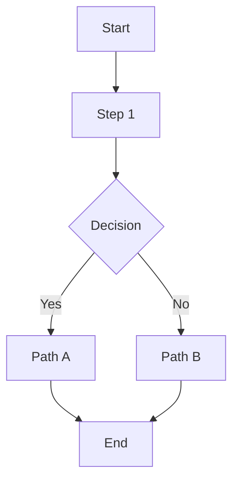
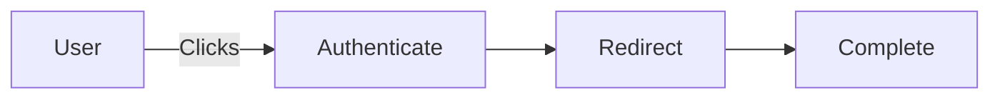
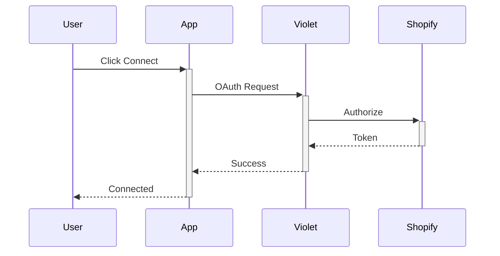
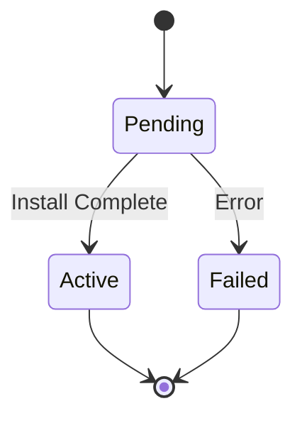

# Gitbook/Mintlify Documentation Conventions

## Overview

Violet's external documentation uses Gitbook/Mintlify-compatible Markdown with special syntax for callouts, embeds, and structured content. This guide covers the standard formatting conventions used across all Violet documentation.

## File Structure & Frontmatter

### YAML Frontmatter Template

Every documentation file must begin with YAML frontmatter:

```yaml
---
title: Full Page Title
sidebarTitle: Short Sidebar Title
description: Brief description for search and preview (140-160 chars)
---
```

**Field Descriptions**:
- **title**: The full page title (H1 equivalent, usually implicit in rendering)
- **sidebarTitle**: Shorter version for sidebar navigation
- **description**: Meta description for SEO and previews

### File Path Conventions

Documentation files follow this structure:

```
docs/
├── channel-docs/              # Channel partner documentation
│   └── prism/
│       └── violet-connect/
│           └── guides/
│               └── {feature}.md
├── merchant-docs/             # Merchant-facing documentation
└── developer-docs/            # Developer API documentation
```

## Heading Hierarchy

### Usage Guidelines

- **H1** (`# Title`): Page title - Usually implicit from frontmatter, rarely used in body
- **H2** (`## Section`): Major sections (Introduction, Setup, Configuration)
- **H3** (`### Subsection`): Subsections within major sections
- **H4** (`#### Subsubsection`): Deep nesting only when absolutely necessary

**Best Practices**:
- Never skip heading levels (H2 → H4 without H3)
- Keep heading hierarchy shallow (avoid going beyond H4)
- Use descriptive, action-oriented headings ("Configure Your Store" not "Configuration")

## Text Formatting

### Inline Styles

- **Bold** (`**text**`): For emphasis on key terms, field names, UI elements
- *Italic* (`*text*`): For subtle emphasis (use sparingly)
- **Inline code** (`` `code` ``): For technical values, URLs, parameter names, file paths
- [Links](#links): See Links section below

### Lists

**Numbered Lists** (for sequential steps):
```markdown
1. First step
2. Second step
3. Third step
```

**Bullet Lists** (for features, tips, non-sequential items):
```markdown
- Feature one
- Feature two
- Feature three
```

**Nested Lists**:
```markdown
1. Parent item
   - Child item
   - Child item
2. Parent item
```

## Tables

### Standard Table Format

```markdown
| Column 1 | Column 2 | Column 3 |
|----------|----------|----------|
| Value    | Value    | Value    |
| Value    | Value    | Value    |
```

### Common Table Patterns

**Field Descriptions**:
```markdown
| Field | Description | Required |
|-------|-------------|----------|
| `merchantId` | Unique merchant identifier | Yes |
| `storeUrl` | Shopify store URL | Yes |
```

**Comparison Tables**:
```markdown
| Option | When to Use | Benefits |
|--------|-------------|----------|
| Option A | Scenario 1 | Benefit list |
| Option B | Scenario 2 | Benefit list |
```

## Callout Boxes (Hints)

### Information Box
Use for tips, recommendations, and helpful context:

```markdown

This is an informational note. Use for tips and recommendations.

```

### Warning Box
Use for important warnings or cautions:

```markdown

Important warning text. Use for critical information users must know.

```

### Success Box
Use for positive outcomes or confirmations:

```markdown

Success message. Use for confirmations and positive outcomes.

```

**Best Practices**:
- Use callouts sparingly (1-2 per major section max)
- Keep callout content concise (1-3 sentences)
- Always close hint tags properly

## Collapsible Sections

Use HTML `<details>` tags for FAQ and troubleshooting:

```markdown
<details>
  <summary>Question or Problem Title</summary>

  Answer or solution content here.
  Can include multiple paragraphs, lists, code blocks, etc.
</details>
```

**When to Use**:
- FAQ sections
- Troubleshooting problems and solutions
- Optional advanced content
- Long reference information

**Best Practices**:
- Use descriptive summary text (question or problem statement)
- Keep collapsed by default for scanability
- Include complete answer in body

## Code Blocks

### Basic Code Block

````markdown
```language
code here
```
````

### Supported Languages

- `javascript`, `typescript`, `python`, `java`, `go`, `ruby`, `php`
- `bash`, `shell`, `json`, `yaml`, `xml`
- `markdown`, `html`, `css`

### Code Block Examples

**JavaScript/TypeScript**:
````markdown
```typescript
const merchantId = 'mrc_abc123';
const response = await violet.merchants.get(merchantId);
```
````

**cURL**:
````markdown
```bash
curl -X GET \
  'https://api.violet.io/v1/merchants/mrc_abc123' \
  -H 'Authorization: Bearer sk_test_...'
```
````

**JSON Response**:
````markdown
```json
{
  "id": "mrc_abc123",
  "name": "Example Store",
  "status": "active"
}
```
````

## Diagrams & Flow Charts

### Mermaid Diagrams

Gitbook supports Mermaid diagrams in markdown code blocks:

````markdown

````

### Common Mermaid Patterns

**Flow Chart**:
````markdown

````

**Sequence Diagram**:
````markdown

````

**State Diagram**:
````markdown

````

## Links

### Internal Links
Link to other pages in the documentation:

```markdown
[Link text](../path/to/file.md)
[Link text](./file.md)
```

### External Links
Link to external websites:

```markdown
[Violet API](https://api.violet.io)
[Shopify Docs](https://shopify.dev)
```

### Anchor Links
Link to sections on the same page:

```markdown
[See Configuration](#configuration-section)
```

**Note**: Anchor links use lowercase, hyphen-separated heading text.

## Images

### Image Syntax

```markdown

```

### Image Best Practices

- Use descriptive alt text for accessibility
- Store images in `/assets/` directory
- Use PNG for screenshots, SVG for icons/diagrams
- Optimize image sizes (keep under 500KB)
- Use relative paths for repository images

### Image Example

```markdown

```

## Navigation Integration

### Update SUMMARY.md

When adding a new documentation page, update `SUMMARY.md`:

**Location**: `/docs/SUMMARY.md`

**Format**:
```markdown
* [Section Title](./section/)
  * [Page Title](./section/page.md)
  * [Another Page](./section/another-page.md)
```

**Example**:
```markdown
* [Guides](./channel-docs/prism/violet-connect/guides/)
  * [Shopify Custom App Migration](./channel-docs/prism/violet-connect/guides/shopify-custom-app-migration.md)
  * [BigCommerce Guide](./channel-docs/prism/violet-connect/guides/bigcommerce-guide.md)
```

**Best Practices**:
- Maintain alphabetical or logical order
- Use consistent indentation (2 spaces per level)
- Test navigation links after adding

## Content Guidelines

### Writing Style

- **Active voice**: "Click the button" not "The button should be clicked"
- **Present tense**: "The system processes" not "The system will process"
- **Direct address**: "You can configure" not "Users can configure"
- **Concise**: Remove unnecessary words

### Formatting Consistency

- **Field names**: Always use backticks and camelCase: `merchantId`
- **UI elements**: Bold for buttons and labels: **Add Pre-Registration**
- **URLs**: Always use inline code: `https://connect.violet.io`
- **Status values**: Use inline code: `active`, `pending`, `failed`

### Structural Patterns

**Introduction Section** (always first):
- Brief overview of what this page covers
- Link to prerequisites if needed
- Expected outcome

**Step-by-Step Instructions**:
1. Use numbered lists for sequential steps
2. Start each step with an action verb
3. Include expected outcomes after key steps

**Troubleshooting Section** (when needed):
- Use `<details>` tags for problems
- Include: Problem → Cause → Solution
- Provide specific, actionable fixes

**FAQ Section** (when needed):
- Use `<details>` tags for questions
- Answer questions directly and concisely
- Link to related documentation

## Document Length Guidelines

- **Quickstart**: 300-500 words, complete in 5 minutes
- **Guide**: 800-1500 words, step-by-step with examples
- **Reference**: As long as needed, comprehensive coverage
- **FAQ**: 5-10 questions, 50-100 words per answer

## Checklist for New Documentation

- [ ] YAML frontmatter is complete and accurate
- [ ] Heading hierarchy is logical (H2 → H3 → H4)
- [ ] Code blocks specify language
- [ ] All links work (internal and external)
- [ ] Images have descriptive alt text
- [ ] Tables are properly formatted
- [ ] Callout boxes are properly closed
- [ ] SUMMARY.md is updated with new page
- [ ] Content follows writing style guidelines
- [ ] No placeholder text remains ("TODO", "[TBD]")
